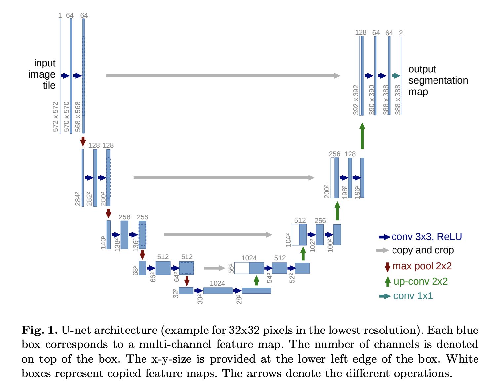

Определение маски Unet сеть для нахождения и выделения контура 


# Math 
1. Convolution

[Convolution explained](https://www.youtube.com/watch?v=KuXjwB4LzSA&ab_channel=3Blue1Brown)

	(1,2,3) * (4,5,6) = (4,12,28,27,18)
```	
    123      123    123
654        654     654
            
           1x4   1x5+2x4 

```


For blurring an image 
For detecting variation in the pixel value 
For sharpening 

Kernel is a table which we use as the second term in convolution

Kernel for detecting color variation for example may look like

|-0.25|-0.5|-0.25|
| :---        |    :----:   |          ---: |
|0|0|0|
|0.25|0.5|0.25|


 Image * Kernel 

All depends on different Kernel s

So convolutional neural network use data to figure out what the kernels should be in the first place!

Fast way to compute convolution fftconvolve 

Let a = [], b = [] - lists which convolution we want ot calculate 

Denote f(x) as a polynom with a<sub>i</sub> as coefficients and g(x) as a polynom with b<sub>i</sub> as a coefficients. Than calculate fast fourier transform(evaluating polynoms at some specific imaginary points) than multiply to results and than implement inverst FFT. O(n*log(n)).


2. ReLU 
[ReLu explanation](https://iq.opengenus.org/relu-activation)
ReLU - Rectified Linear Unit

f(x) = max(0, x)

We use ReLU as an activation function. So such function can activate the computation  when our data have reached specific values. 

Important remark - it must be non linear in order to  to make the network learn complex patterns in the data.

# Terms for neural networks 

## Features

In our context of images, we refer to features as our image with some filters applied to it. So it may be some filters which detecs edges / textures / brightness / etc.

## Convolution

Suppose we have an image and a specific kernel. Than we are applying this kernel over and over our image with a specific stride and do a convolutional type of multiplication (explained above).
 
Usally kernel is used 3 * 3

## MaxPooling 

Picking maximum value of a specific part of image. Doing so for the hole image with a specific stride.  Usally from 2 * 2. 

AveragePooling also can be used but rarely  

## BatchNormalization

Also can be used between layers.

Normalizes all the values to a certain range.
Can improve training speed and also allows each layer of a network to kinda learn by itself.

## Flattening 

Convert 2D to 1 D  

## Optimizer Adam

Some kind of extension to [Stochastic gradient deescent](https://en.wikipedia.org/wiki/Stochastic_gradient_descent). But is more efficient.

## Epoch 

As we are using big datasets we need to separate them in order to handle them.

One Epoch is when an enitire dataset is passed forward and backward through the network once.  

So we are dividing our number of samples into batches, pass all the batches through a network, it will require samples / batch_size iteration. That's an Epoch.

But number of epoch differs from problem to problem.


## Dropout 

Randomly select n percent of neurons /  pixels and reduce their importance to 0 or disable them.


## Loss function 

Method of evaluating how good a our function models a dataset. 
MSE as an example. But for convolutional networks it is more often to use [binary crossentropy](https://en.wikipedia.org/wiki/Cross_entropy)

# UNET - U shape NET

## Why use UNET?

- U-Net learns segmentation in an end-to-end setting.
You input a raw image and get a segmentation map as the output.

- U-Net is able to precisely localize and distinguish borders.
Performs classification on every pixel so that the input and output share the same size.

- U-Net uses very few annotated images.
Data augmentation with elastic deformations reduces the number of annotated images required for training.

## Architecture of UNET 



[Uncomplicated explanation of UNET](https://towardsdatascience.com/unet-line-by-line-explanation-9b191c76baf5)
[Another Explanation](https://www.youtube.com/watch?v=GAYJ81M58y8&ab_channel=DigitalSreeni)

UNET architecture is designed for Semantic segmentation. It means that every pixel which represents the object we are looking for may or will be marked.


<dl>
<dt>contracting </dt>
<dd>Сжимающй<dd>
<dt>expansive</dt>
<dd>Расширительный</dd>
</dl>


The architecture is symmetric and consists of two major parts — the left part is called contracting (encoding) path, which is constituted **by the general convolutional process**; the right part is expansive (decoding) path, which is constituted by **transposed 2d convolutional layers**"

So, the process:
1. Layer 1  
From 1 image do a convolution, which will produce n another images, and do a convolution on them. We are usually using 3 x 3 Kernel. Than maxpool all of them into n images with a resolution of 2 times lower.

Note: When we are doing a convolution we can either add some pixels to the images to expand it's borders to get the same size of an image after applying filters to it. (Padding = same).
Or we can do n't do it but we'll have an image with a little bit different size. 

2. Repeat the process n steps 

3. Upsample m images in order to get 2 times more resolution but with half of images.

4. While we are upscaling images on the n-th step we are also **Concatinatate filters from the n-th step when we compressed them**. So we are doubling our number of "features" of images. And this information gives us an additional information so we are willing to do a semantic segmentation correctly.

5. Repeat until we've got 1 image.

6. In between various steps we can dropout some random number of pixels. It's usally used to prevent overfitting of our model.


Note: there are some known kernels for specific purposes (detecting right edges for example) but as we do not know what will help us to find and object we are trying some random kernels. It is better to set a first that kernel to normal distribution. (he_normal)

# How to implement 

## Functions we'll use and their meaning.

1. ### [Conv2D from Keras](https://pytorch.org/docs/stable/generated/torch.nn.Conv2d.html)

2. ### 


### Useful links


[Original source code, trained network](https://lmb.informatik.uni-freiburg.de/people/ronneber/u-net/)


[An improved version of
Unet based on multi-scale](https://arxiv.org/pdf/2012.10952.pdf)